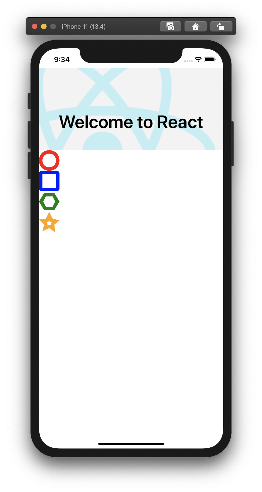

# Autogenerated custom icon font for your RN app

1. Add this package to your app (`yarn add -D` or `npm i -D`)
1. Add svg icons in some folder in your app
2. Add this kind of command in scripts sections in your `package.json`

    `"fonts": "rn-fonts -s path/to/svg/**/*.svg -o path/to/destination -n MyPrettyFont",`
    `"post:fonts": "cp -f path/to/destination/MyPrettyFont.ttf android/app/src/main/assets/fonts/MyPrettyFont.ttf"`
    
    The last one need for refreshing fonts in Android. Application should be recompiled manually

3. Generate your fonts with `yarn fonts` or `npm run fonts`
4. After first generation you must install generated font in your app. You can do it with any way you prefer

### Options

```
  -s, --svg [pattern]      glob pattern for svg files
  -o, --output [path]      output directory
  -n, --fontName [string]  output font name
  -h, --help               display help for command
```

### Test app

Pleas check test app in `test/testApp` for more details.


